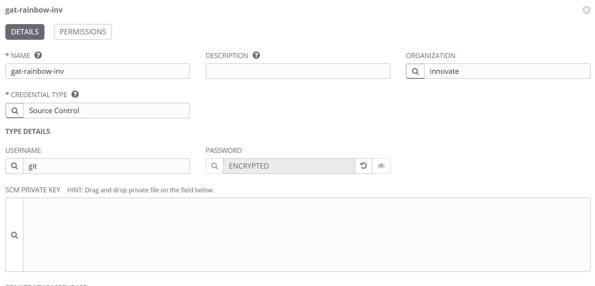

# README

## Synopsis

This automation performs Disc Clean-up for C drive on windows remote endpoint.

## Variables

| Variable name           |   Type     | Default value |  Description                 |
| ----------------------- | ---------- | ------------- |  --------------------------- |
| script                  | String     | None  | Script to perform clean-up  |
| download_path           | String     | None  | Download location on the remote endpoint |

## Results from execution

In case of failures, refer to the Job error log for more details.

The following return codes are associated with this asset:

| Return Code | Return Code Group  | Support  |   Comments  |  
| ----------- | ------------------ | -------- |  ---------  |
| 13001       |  misconfiguration  |  account | Fail the setup disc clean-up pre-requisites |
| 13002       |  misconfiguration  |  account | Failed to execute on the remote endpoint |

## Procedure

Execute the job template from the Ansible tower to perform disc_cleanup on the remote endpoint.

### Generic Overview

* Asset will consume powershell script, download_path variables to perform disc_cleanup on C drive.

## Deployment

### Run playbook using Ansible Tower

Please refer to the below steps if you want to create manually:

### Create GitHub Source Credentials

Create Github credentials (needed for the Project), if not already created on the Ansible Tower. Examples operate with imaginary account inv.

You also need Tower credentials with permissions (must have at least 'Member' and 'Auditor' roles for the Tower Organization).

### Setting up the Project in Ansible Tower

* **ORGANIZATION**: The organization of your account `<org>`
* **NAME**: The name of the project should be `<org>_project_disc_cleanup_<custom>`
* **SCM Type**: Git
* **SCM URL**: `https://github.kyndryl.net/Innovate/gat_disc_cleanup.git`
* **SCM CREDENTIAL**: The Source Control Credential for your organization's functional ID
* **SCM UPDATE OPTIONS** `Checkboxes`: If the SCM Branch "dev" is used, then it is recommended to switch on `CLEAN` and `UPDATE REVISION ON LAUNCH` to always get the latest version of assets.
* **SCM BRANCH/TAG/COMMIT**: `1.0/main`

  1. If you want to keep the compatibility of the code with your configuration but also want to receive bugfixes automatically, use versioned branches (for example, `v1.0.0` automatically gives all 1.0.x bugfixes).
  2. For strict code control (required by some customers), use [releases](https://github.kyndryl.net/Innovate/gat_disc_cleanup/releases) of this collection. It is recommended to use the [latest](https://github.kyndryl.net/Innovate/gat_disc_cleanup/releases/latest) release.
  3. In case of testing new pre-production functionality, you can select specific branch (for example, `dev` or `testing_dev_branches`)

### Required Credentials

* Machine Credential for the hosts
* Ansible Tower credentials
* SSH proxy hop credential ( Format: <b> "{{orgName}}_cred_sshproxy_3hop </b> )

Note: Please keep the Credentials updated.

### Setting up the Job Template in Ansible Tower

* **NAME**: The name of the job template must be `<org>_jobtemplate_disc_cleanup_install_configure`. Example: *inv_jobtemplate_disc_cleanup_install_configure*
* **INVENTORY**: The inventory used by your organization
* **PROJECT**: `<org>_project_disc_cleanup_<custom>`
* **PLAYBOOK**: install_disc_cleanup.yml
* **CREDENTIALS**: See [Required Credentials](#required-credentials)
* **EXTRA VARIABLES**: The below variables are required if you want to override the default variables. The given values to these variables are only examples:

If everything is set up correctly, you can launch the template.  

In case of any errors,  check the [Known Problems and Limitations](#known-problems-and-limitations)

**Job Template**

## Known problems and limitations

Ansible playbook execution will fail if the {{ disc_cleanup_url }} is invalid.

## Prerequisites

[Standard ansible Prerequisites](https://github.kyndryl.net/Continuous-Engineering/TWPs)

## Examples

### Sample Playbook

For sample playbook, please refer to <https://github.kyndryl.net/Innovate/gat_disc_cleanup/blob/main/install_disc_cleanup.yml>

## Support

To open a bug report or enhancement request

* Go to the [issues page](https://github.kyndryl.net/Innovate/gat_disc_cleanup/issues)
* Click on the new issue at the top right
* Add relevant issue `Title`
* Describe the issue in detail in the comment section
* Attach relevant files/screenshots if there are any
* Leave sections on the right-hand side like Assignees, Labels, Projects, Milestone etc same as the default
* Click on a `Submit new issue`

For Global Automation asset support, please follow the instructions given on the URL: [Global automation (Innovate)](https://kyndryl.sharepoint.com/sites/Global-Automation/SitePages/Support1.aspx)

### Project leads

* sunil.varma@kyndryl.com
* yedu.kondalu.sanaka@kyndryl.com

## License

[Kyndryl Intellectual Property](https://github.kyndryl.net/Continuous-Engineering/CE-Documentation/blob/master/files/LICENSE.md)
